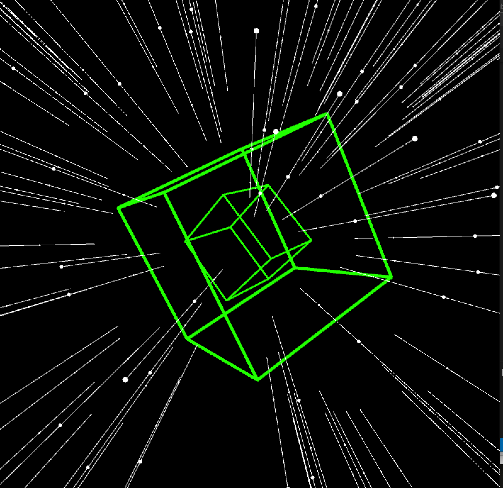

# Music Visualiser Project

Name: Sumaiya Al Amri

Student Number: D17126680

## Instructions

- Fork this repository and use it a starter project for your assignment
- Create a new package named your student number and put all your code in this package.
- You should start by creating a subclass of ie.tudublin.Visual
- There is an example visualiser called MyVisual in the example package
- Check out the WaveForm and AudioBandsVisual for examples of how to call the Processing functions from other classes that are not subclasses of PApplet

# Description of the assignment

My assignment is a java code that uses music frequencies to move 3D and 2D objects. In my assignment I have a black background and stars to look like the space, the starts moves towards the user and the speed of that movement depends on the audio frequency. 

# Instructions

In this code, I have a small menu that contains extra objects to be displayed in the screen:

 - The 1st element in the menu can be chosen by pressing number 1, it will display a big cube that rotate in a specific speed and change it size based on the frequency. 

 - The 2nd element of the menu can be chosen be pressing number 2, it will display 2 cubes one inside the other. The 2 cubes rotate in a different speed but the changing in the size is also controlled by the music frequency. 

 - The 3rd and last choice can be chosen by pressing key 3, it displays small points that move in a circle and away from the centre point. This is the only 2D element in my code and it doesn’t move based on the frequency. I have it just for fun and I was trying something new.  

# How it works

You need to run the Main.java file, then press space to play the music file. 
To choose from the objects menu press 1, 2, or 3. 

# What I am most proud of in the assignment

I’m proud that I created the space background because I love the starts and I thought it will be too hard to learn how to implement it, but it was not actually that hard plus I enjoyed doing it.

# Markdown Tutorial

This is the draw stars code:

```Java
public void draw()
{
	calculateAverageAmplitude();
    background(0);
    translate(width/2, height/2, -250);
    strokeWeight(1);
    float starsSpeed = 2 + (getAmplitude() * 400);
    speed = lerp(speed, starsSpeed, 1.0f); 

    for (int i = 0; i < star.length; i++) {
    	update(star[i]);
        show(star[i]);
    }

}
```

This is an image of the code while running:




This is my assignment youtube video:

[](https://youtu.be/q1L98ofnGVI)

This is menu of keys and their description :

| Key | Description |
|-----------|-----------|
|Space | Turn on the audio |
|1 | Display single cube rotating  |
|2 | Display 2 cubes rotating |
|3 | Display sequence of points moving in circle and away from the centre |

